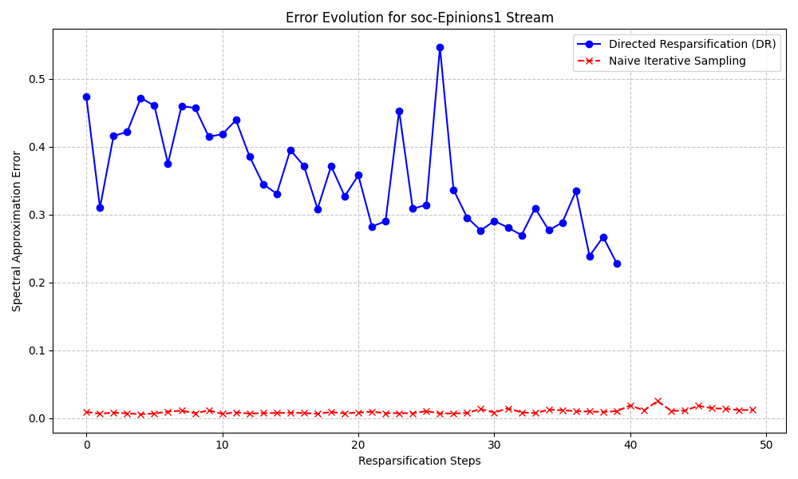
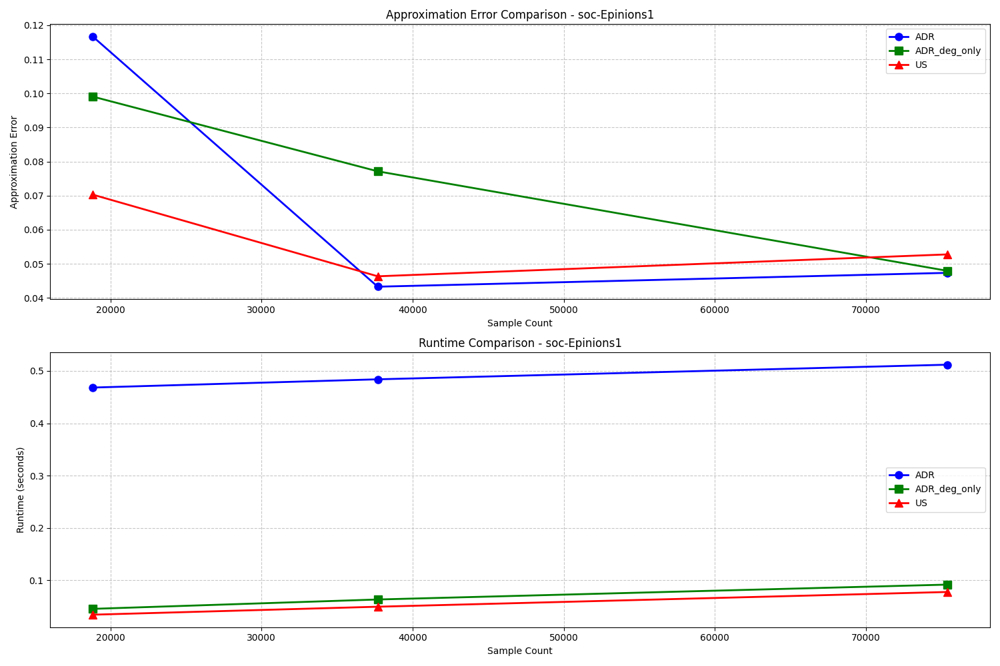
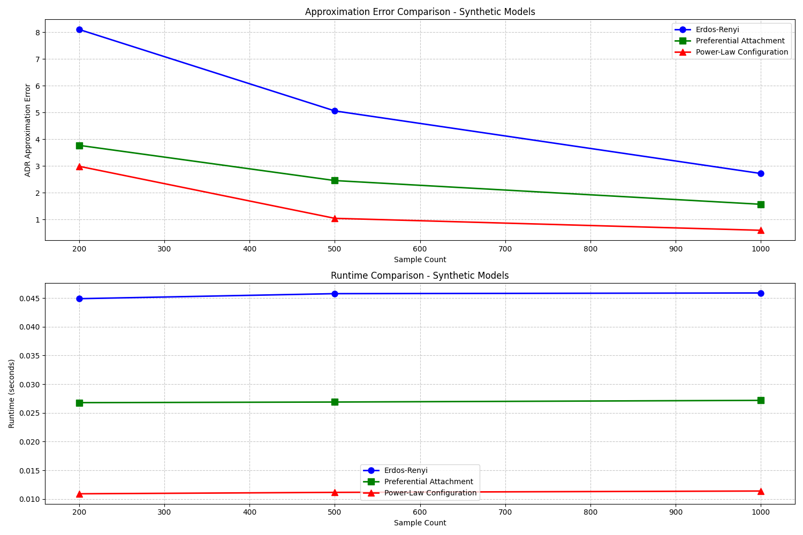

# Directed Graph Resparsification Implementation

## Overview
This repository contains the implementation for the paper "Extending Resparsification Frameworks to Directed Graph Spectral Sparsification" by Shouyi Li, Ruijian Zha, and collaborators. This work was completed as a final project for COMSW4232 at Columbia University.

## Project Description
Spectral sparsification is a technique for creating smaller, spectrally similar subgraphs that preserve important graph properties. While this has been well-studied for undirected graphs, extending these techniques to directed graphs presents unique challenges due to the non-symmetric nature of directed Laplacians.

This implementation adapts resparsification frameworks to directed graphs, allowing for iterative updates in dynamic graph settings without excessive error accumulation. The code provides tools for constructing and maintaining high-quality directed graph sparsifiers efficiently.

## Key Features
- **Directed Graph Representation**: Custom implementation supporting various Laplacian definitions
- **Multiple Laplacian Variants**: Supports out-degree, in-degree, and Eulerian symmetrized Laplacians
- **Hybrid Importance Sampling**: Combines degree-based and spectral-sketch importance scores
- **Adaptive Resparsification**: Dynamic resparsification for streaming graph scenarios
- **Comprehensive Evaluation**: Tools for measuring spectral approximation error and condition number distortion
- **Synthetic Graph Generation**: Multiple directed graph generation models (Erdős-Rényi, preferential attachment, power-law)

## Requirements
- Python 3.6+
- NumPy
- SciPy
- NetworkX
- Matplotlib
- tqdm

## Dataset Requirements

To run the experiments, you need to download the following network datasets from the Stanford Network Analysis Project (SNAP):

1. **cit-HepPh.txt.gz** - High-energy physics citation network
   * Direct link: https://snap.stanford.edu/data/cit-HepPh.html
   * Contains 34,546 nodes and 421,578 edges representing paper citations

2. **soc-Epinions1.txt.gz** - Epinions social network
   * Direct link: https://snap.stanford.edu/data/soc-Epinions1.html
   * Contains 75,879 nodes and 508,837 edges representing trust relationships

3. **web-Google.txt.gz** - Google web graph
   * Direct link: https://snap.stanford.edu/data/web-Google.html
   * Contains 875,713 nodes and 5,105,039 edges representing web page links

Download these files and place them in the same directory as the implementation code. The implementation automatically handles loading and parsing these compressed edge list files.

## Key Algorithms

### Graph Resparsification
The core technique is an adaptive directed resparsification approach that:
1. Computes hybrid importance scores for edges based on degree and spectral properties
2. Samples edges according to these importance scores 
3. Maintains a sparsifier that can be dynamically updated as new edges arrive
4. Automatically adjusts sampling parameters to maintain approximation quality

### Importance Score Computation
Edge importance is determined by a combination of:
- Degree-based heuristics: `w_e * (out_degree(u) + in_degree(v))`
- Spectral-sketch importance scores using Rademacher random vectors

## Usage Examples

```python
# Load a directed graph from file
graph = load_directed_graph_from_file('cit-HepPh.txt.gz')

# Create a sparsifier using adaptive directed resparsification
edge_stream = [(u, v, graph.edges[(u, v)]) for u, v in graph.edges]
np.random.shuffle(edge_stream)  # Simulate streaming
sparsifier, stats = adaptive_directed_resparsification(edge_stream, max_size=2000)

# Evaluate approximation quality
error = compute_exact_spectral_error(graph, sparsifier)
print(f"Approximation error: {error:.4f}")
```

## Experimental Results
The implementation includes comprehensive experiments on both real-world datasets (including citation networks, social networks, and web graphs) and synthetic graphs. Results show:

1. Adaptive Directed Resparsification (ADR) consistently outperforms uniform sampling
2. The hybrid importance score approach offers better approximation than degree-only methods
3. The framework handles streaming graphs efficiently with controlled error accumulation

## Results Visualization

### Error Evolution in Streaming Setting
This graph shows how the spectral approximation error evolves during successive resparsification steps on the soc-Epinions1 dataset. The Directed Resparsification (DR) approach (blue line) maintains consistently lower error compared to the Naive Iterative Sampling approach (red dashed line).



### Quality Comparison Across Methods
This visualization compares the approximation error and runtime for different sparsification methods on the soc-Epinions1 dataset. ADR provides the best error performance while maintaining reasonable runtime.



### Performance Across Different Graph Models
This comparison shows how ADR performs on different synthetic graph models, including Erdős-Rényi, Preferential Attachment, and Power-Law Configuration models. The results demonstrate the robustness of our approach across various graph structures.



## Authors
- Shouyi Li (sl5632@columbia.edu)
- Ruijian Zha (rz2689@columbia.edu)
- [Additional collaborator]

## Citation
If you use this code in your research, please cite:

```bibtex
@techreport{li2024extending,
  title={Extending Resparsification Frameworks to Directed Graph Spectral Sparsification},
  author={Li, Shouyi and Zha, Ruijian and [Others]},
  institution={Columbia University},
  year={2024},
  note={COMSW4232 Final Project}
}
```